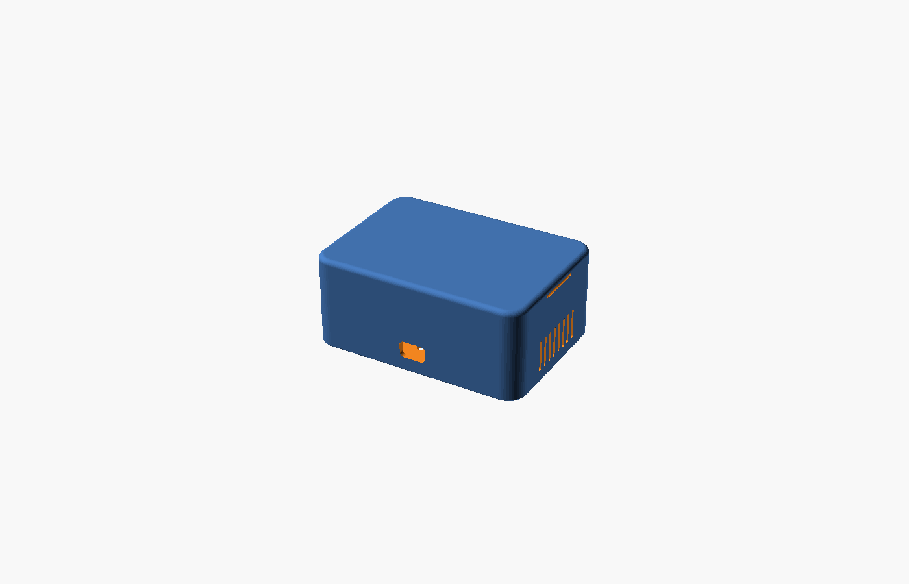
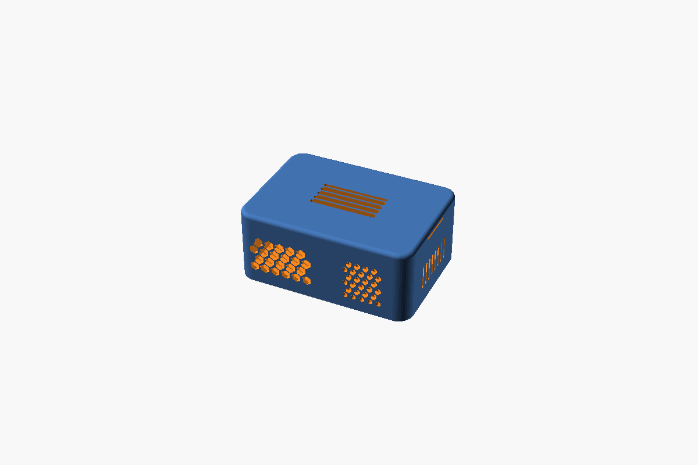
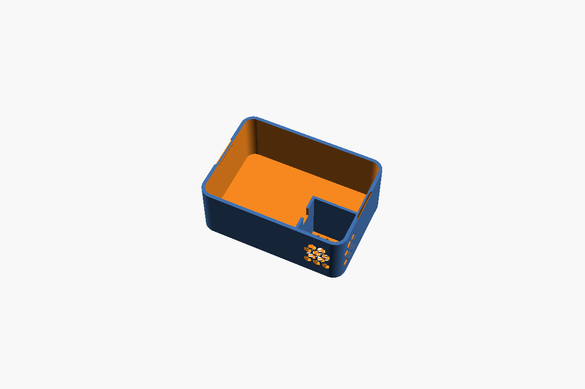
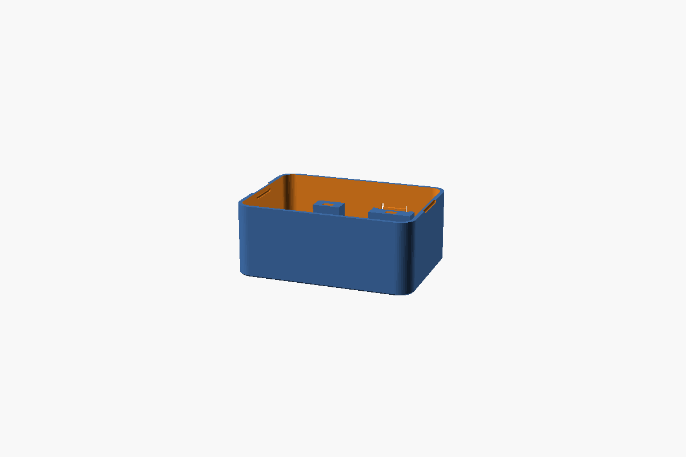
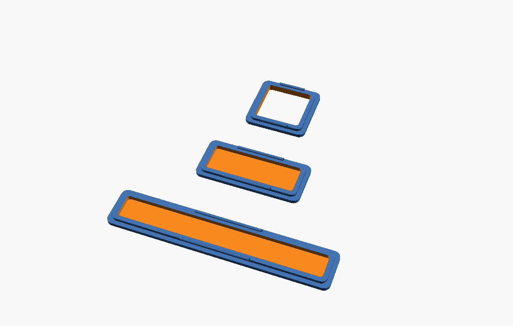

# ESP32 Box Builder

*English · [version française](README.fr.md)*

A 3D-printed enclosure designer for maker electronics (ESP32,
sensors, modules…): a web interface where you drag & drop your
connectors, PCB standoffs, compartments and vents, and generate
print-ready STLs.

**Try it online, nothing to install:**
**https://timiliris.github.io/esp32-box/builder.html**
— STL generation runs right in your browser (OpenSCAD WebAssembly,
~1–3 min per part). Running locally with OpenSCAD installed is much
faster. The interface is bilingual (FR/EN, auto-detected).

A modern enclosure design: continuous shell with large radii,
filleted top edges, flush **snap-fit lid with no visible screws**.
A single parametric OpenSCAD source file
([esp32-box.scad](esp32-box.scad)).



| | |
|---|---|
|  |  |
| *Placeable vents: honeycomb, grid, slots* | *Vented compartment to isolate a sensor* |
|  |  |
| *6×6 tact switch buttons: flex tongue and plunger* | *Snap-in windows to print in clear filament* |

## Install

Requirements: [OpenSCAD](https://openscad.org) and Python 3
(bundled on macOS; on Debian/Ubuntu: `sudo apt install openscad python3`).

```bash
git clone https://github.com/timiliris/esp32-box.git
cd esp32-box
python3 builder-server.py
```

On macOS, double-clicking `builder.command` does the same.
The interface opens at http://127.0.0.1:8765.

## The visual builder

The local server (Python stdlib, port 8765) serves the interface and
enables **direct generation**: “Generate STL” buttons call your
installed OpenSCAD and download a print-ready file (**binary STL**,
~5× smaller than ASCII; if port 8765 is taken the server falls back
to the next one and the interface finds it). Opening `builder.html`
alone also works: the interface falls back to copy-paste commands —
or, on the hosted version, to in-browser generation.

The layout is built around an **icon rail** on the left
(JetBrains-style): **Cutouts** panel (categorized palette), **Floor
layout** (PCB, cell holders, walls, compartments), **Objects**
(project list) and **Case** (dimensions, options, wall mounting) —
the selection inspector stays pinned at the bottom.

Face-by-face 2D editing (front / back / sides / **lid** / **floor** —
a screen on top, vents underneath, anything goes), drag & drop with
snapping (centers, alignment between cutouts, 0.5 mm grid), **zoom**
(Ctrl+wheel) and panning, a palette of ready-made connectors with
tooltips (USB-C, USB-A, jack, push buttons, PG7, rocker, LED/radar
windows), an **Objects** panel listing the whole project (click to
jump), **wall-mounting tabs** (2 or 4 Ø 4.2 eyelets printed with the
base), keep-out zones displayed (rounded corners, lid skirt band),
and a **PCB standoff tool**: pick a board or module (or type a
measured spacing), drop the standoff group on the floor, move and
rotate it. The list covers dev boards, standard **proto board** kits
(2×8 to 9×15 cm — Ø2 corner holes centered ~2 mm from the edges,
spacing = dimension − 4, measured ≈) and **common sensor modules** —
GY-BME280 (2 holes · 10, verified), 0.96″ OLED SSD1306, GY-521,
LM2596 buck… — including **2-hole boards** (pair or diagonal) with
thin posts and M2 pilot holes for small modules. Values marked ≈ are
typical clone dimensions: check with calipers, they vary by
manufacturer.

**Internal walls** to isolate a sensor (keep the BME280 away from
the PSU heat…): printed with the base, full height (up to the lid)
or partial, adjustable thickness, optional top **cable pass**, and
optional **vent crenels** top + bottom to let air flow. Let them
overlap the outer walls: they get trimmed to the inner volume and
joined cleanly. And full **compartments**: a closed full-height
frame around a zone, with optional **honeycomb cut into the floor
below and the lid above** — outside air flows through the
compartment like a chimney, the sensor reads room air while staying
isolated from the box's heat. Cable pass on the wall of your choice
(regenerate the lid when its vent is enabled). Same for **cell
holders** (18650 / 21700 / 14500): a printed cradle with two snap
jaws and end stops, placed on the floor as an object.

At the bottom, ready-to-copy OpenSCAD commands (base + lid) —
everything goes through the `.scad`'s `cuts`, `standoff_sets`,
`cell_holders`, `dividers` and `compartments` parameters. The
project auto-saves in your browser.

Also: **3D preview** (closed box with every cutout, drag to rotate,
interior view with the lid removed, collapsible) and **undo/redo**
(header buttons, Cmd+Z / Cmd+Shift+Z) — a drag or a typed value
counts as a single step.

## Sizes

**Inner** dimensions (outer = +4.8 mm in X/Y):

| Preset | Inner (mm) | Typical use |
|---|---|---|
| S | 70 × 50 × 30 | a lone ESP32 + sensor |
| M | 100 × 70 × 40 | ESP32 + mini breadboard / relay |
| L | 140 × 100 × 50 | multi-module builds, PSU |
| XL | 180 × 130 × 60 | big catch-all |
| custom | `custom_inner = [x, y, z]` | whatever you need |

## Printing

- **No supports** — base and lid print as-is (the lid is already
  modeled outer-face down).
- 0.2 mm layers, 2–3 perimeters, 15 % infill is plenty.
- PLA or PETG. PETG if the box runs warm (PSU, relays) — and for
  softer snap clips.
- Lid too tight/loose? Adjust `lid_clearance` (0.25 default).
- **Built-in FDM compensation**: every functional hole and cutout is
  widened by `hole_comp` (0.3 mm default) to counter print
  shrinkage — the dimensions you enter are the connector's nominal
  ones. Round holes in walls print as **teardrops** (45° roof,
  `teardrop`): no sagging, no supports. Both are adjustable in the
  builder (“Hole clearance” / “Teardrop holes”).

## Lid

- Default `lid_fix = "snap"`: snap-fit lid (ridges on the skirt,
  grooves in the walls), zero visible screws. To open: push the lid
  edge up through one of the two side notches.
- `snap_sides` / `notch_sides` (`x` = sides, `y` = front/back): put
  clips and notches on faces **without connectors**. Default: sides.
- `lid_fix = "screws"`: 4 × countersunk **M3×10** on top if you want
  it locked (2.7 pilot, self-tapping or machine M3).
- Boards: 4 × self-tapping **M2.5** into the standoffs (2.2 pilot).

## Highlights

- **Flush USB-C**: for a **bare** female USB-C receptacle (the
  solder-shell type, no breakout) — a built-in channel mount behind
  the wall, receptacle nose flush with the outside. The opening
  (8.7 × 2.9) passes the cable's shell but not the receptacle:
  plugging pushes it against the channel's back stop, unplugging
  presses it against the wall — zero stress on the solder joints,
  zero glue.
- **6×6 tact switch buttons** (the standard little black 4-pin
  switches), two styles, both with a **built-in cradle** inside:
  solder two wires, slide the switch in from the top, alignment is
  guaranteed by construction. “Flex button” = printed in place
  (flexible tongue in the wall, flush disc outside, zero assembly);
  “Plunger button” = sliding piston (cap printed with the Inserts
  plate, inserted from the inside, retained by its flange — the
  switch's own spring returns it).
- **Snap-in windows (inserts)**: `insert` cutouts create a
  **rabbeted** through-hole in the wall, and `part="inserts"`
  generates the matching windows — flush plate outside, body through
  the wall, two ridges snapping behind it. The inside is **hollowed
  out**: only a thin membrane (“Skin”, 0.8 default) remains — LEDs
  diffuse nicely, mmWave radar sees through — and **skin 0 = open
  frame**, for a ToF laser or any sensor that needs open air. Print
  them in **clear PETG** (LED, radar) or **white** (diffuser) while
  the box prints in your color.
- **Placeable vents** anywhere (walls, lid, floor): vertical slots,
  horizontal slots, staggered round grid, honeycomb.

## Regenerate an STL from the CLI

```bash
openscad -o box.stl -D 'size_preset="L"' -D 'part="base"' -D 'cable_hole=true' esp32-box.scad
```

## Included variants

See the [release](https://github.com/timiliris/esp32-box/releases)
zip for ready-to-print S/M/L/XL bases and lids plus a sensor-box and
a power-bank variant. Details in the [French README](README.fr.md).
