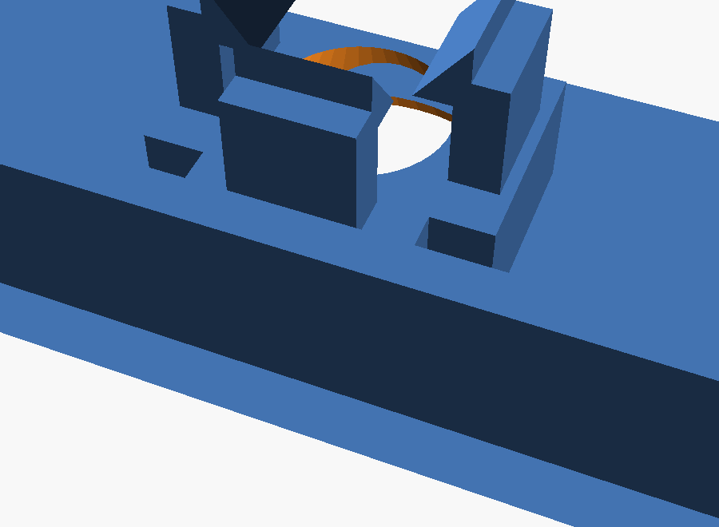

# Elements reference

All dimensions are the **nominal connector sizes** — the FDM
compensation (default +0.3 mm) is applied at generation time.

## Connectors (walls)

| Element | Opening | Notes |
|---|---|---|
| Flush USB-C | 8.7 × 2.9 | For a **bare** female USB-C receptacle (solder shell). Built-in channel mount behind the wall; nose flush outside. Geometric lock: plugging pushes against the back stop, unplugging presses the shell against the wall. Insert from the top, wires out the back. Shell length is adjustable in the inspector (default 12.6 mm — measure yours: 7.35 / 10.5 / 12.6 mm variants exist). |
| USB-C | 10 × 6 | Pass-through for a whole cable connector, when the receptacle sits recessed on a board. |
| USB-A | 14 × 8 | Same, USB-A. |
| micro-USB | 9 × 5 | Same, micro-USB. |
| Port row | 64 × 10 | Wide opening for a power-bank module's port row. |
| Power bank ports | 62 × 9 | Port-row opening matched to a 65.5 × 27 × 7.5 power bank charger module. Default height assumes the module sits on 5 mm standoffs — pair it with the matching standoff preset. |
| Jack 3.5 | Ø 6.5 | Panel-mount jack, screws with its own nut. |
| Push btn 7 / 12 | Ø 7.2 / 12.2 | Panel-mount push buttons (PBS-110 style / 12 mm metal). |
| PG7 | Ø 12.5 | Cable gland for a clean strain-relieved cable exit. |
| Rocker KCD1 | 19.2 × 13.2 | The standard small rocker switch. |
| LED pipe 1.75 | Ø 1.8 | Push a short piece of **clear filament** in as a light pipe for a status LED. Friction fit. |

## 6×6 tact switch buttons (walls)

Both use the same **built-in cradle**: a chamfered block behind the
wall with an open-top pocket for a standard 6×6 tact switch. Solder
two wires, slide the switch in — alignment is guaranteed.

- **Flex button** — printed in place: a U-slot cuts a flexible
  tongue in the wall (thinned hinge at the top), with a flush cap
  outside and a presser boss inside. Zero assembly.
- **Plunger button** — a sliding piston: cap prints on the Inserts
  plate, inserted from the inside, retained by its flange; the
  switch's own spring returns it. A real protruding clicky button.

Keep them away from corners (the cradle needs ~13 mm of wall on each
side for the flex version) — the builder warns if too close.

## Displays

**7″ 1024×600 display window** (lid) — sized for the Waveshare
ESP32-P4-WIFI6-Touch-LCD-7B and equivalent panels. Measured from the
official drawings:

| | mm |
|---|---|
| PCB outline | 164.00 × 97.00 |
| Mounting holes (spacing) | **156.00 × 89.00**, centered on the PCB |
| Cover glass | 164.28 × 99.17 |
| **Active area** | **154.58 × 86.42** |
| Bezels | left 3.06 · right 6.65 · top 4.02 · bottom 8.73 |

The panel is **not centered**: its active area sits 1.79 mm left of
and 2.36 mm above the board center. The palette window is placed with
that offset already applied (viewed from outside the lid, USB side on
the left) and is 1.5 mm smaller per edge so the bezel overlaps the
panel border.

**How it is held.** The cover glass (164.28 × 99.17) covers the whole
PCB, so the 4 mounting holes are **not reachable from the front** —
you cannot screw through the screen, and a boss coming down from the
lid would crush the glass. The module **clips into the lid** instead:
**retaining clips** (Floor layout panel → *Add retaining clips*) rise
from the lid's inner face, pass around the glass on the outside and
hook over the **back of the PCB**. The lid frame holds the module
from the front, the clips from behind — no screws at all.

Two depths matter, both measured from the glass resting under the lid
(values below measured on the real module):

| | mm |
|---|---|
| Screen assembly (glass + panel + PCB) | **8.6** — the edge connectors sit at this level |
| Tallest point of the board (top of its own standoffs) | **14.5** — where our printed posts land |

So the board carries ~6 mm standoffs of its own — which is why the
inner height is 45 mm: the module takes 14.5 from the lid, leaving
about 30 mm for the down-facing plugs and their cables.

*Side clearance* (0.3 default) is the gap left around the module.
Printed pockets close up on themselves, and a small module needs
proportionally more — the 7B camera uses 0.5.

The clips catch at the **screen thickness** (8.6): set *Catch depth*
to your module's glass-to-PCB-back distance, *Module width/depth* to
its outline, and *Lip* to how far the hook overlaps the board (2 mm
by default). Two clips per side is plenty for a 7″ panel.

**Leave one side open.** A glass panel cannot be forced between eight
rigid clips, so *Insertion side* removes the clips from one edge: you
slide the module in underneath the others from that side, and the
remaining clips hold it. The plan marks the open edge with an arrow.

**Clips avoid the connectors.** Positions are not evenly spaced: the
builder looks at the wall cutouts on each edge (USB, buttons, card
slot…) and drops each clip into the nearest free gap, so a clip never
lands in front of a port. Narrow the *Clip width* (10 mm on the 7B
template instead of 14) to fit more of them on a crowded edge; if one
still has nowhere to go, a note says so and the others are placed
anyway.

**Adding more.** In automatic mode, raise *Clips ↔* / *Clips ↕* — the
solver spreads that many per edge. Either mode also has four **Add a
clip on edge** buttons in the group's inspector, one per edge: the
new clip lands at the first spot clear of the connectors and of its
neighbours, and the group switches to manual placement. The
insertion-side button still works — hover it and the tooltip reminds
you why that edge was left free. If the module is snapped in flat
rather than slid, set *Insertion side* to **none** and use all four
edges.

**Placing them by hand.** Click any single clip on the lid view and
the group switches to manual placement: drag that clip along its
edge, nudge it with the arrow keys, or send it to the opposite edge
with *Move opposite*. *Remove* — or the Del key — takes just that one
clip out; Ctrl+D duplicates it. Deleting the group's dashed frame
still removes the whole set. The
**hatched red bands** drawn along each edge are the forbidden zones —
a wall connector comes through there, plus a *Cutout margin* of
1.5 mm on each side for the connector body, adjustable per group — and a dragged clip slides to
the nearest free spot rather than entering one. Neighbours on the
same edge repel each other too. Use it to clear a bezel for something
else, a radar window for instance. *Auto-place again* in the group's
inspector hands the placement back to the solver; while manual is on,
*Clips ↔ / ↕* no longer applies, but the insertion side is still
respected.

Board edge features, measured from the drawing (distance from the
top edge, back view — mirror the X when seen from the front):

| Feature | Edge | Position |
|---|---|---|
| ON/OFF slide switch | right | 12.1 from top |
| USB-A (OTG) | right | center 49.4 from top |
| USB-C (USB) | right | center 68.2 from top |
| USB-C (to UART) | right | center 83.4 from top |
| RESET / BOOT buttons | left | centers **10 and 19** from the top edge — measured on the real board |
| Camera | top (opposite the card reader) | **perfectly centred**: 78 mm from each side. Lens centre **5 mm beyond the glass edge** — measured on the real module |
| microSD (TF) slot | bottom | slot spans **78 → 91** from the button edge (78 + 13 + 73 = 164), so 2.5 mm off the board centre — measured on the real board |

Minimum box for this display: about **176 × 109** inner, so the
window clears the rounded corners. The module itself is 10–15 mm
thick but its bottom-facing plugs need room: allow **40 mm** of
inner height. **With the camera, 176 × 117 × 45** — see below.

**One-click template** — the *Case* panel has a **Templates**
section: “Waveshare ESP32-P4 7B — 7″ display” builds the whole
project (176 × 117 × 45 box, offset screen window, retaining clips,
the camera above the screen, and all seven edge openings at the
right height). Wall
openings created this way are **tied to the lid**: change the box
height and they follow the board instead of staying at a fixed
height above the floor. Any wall cutout can be tied that way with
the “Height tied to the lid” checkbox.

## Side openings and the lid skirt

Wall cutouts near the top of the box (typical when a board hangs
under the lid) also **notch the lid skirt**, so connectors, card
slots and buttons pass all the way through. The builder shows a blue
note — “N cutouts cross the skirt — regenerate the lid” — which is
not a problem: the openings do go through, it is only a reminder
that the **lid must be regenerated** along with the base.

## Camera holder (lid)

*Add a camera holder* (Floor layout panel) drops a pocket for a small
camera module on the lid, plus the lens hole. Defaults match the
**tiny FPC camera** that ships with this display board, measured on
the real part:

| | mm |
|---|---|
| Square body | **8.4 × 8.4** |
| Lens barrel | **Ø 7.2**, near-centred |
| Height | **3.6** — from the back, level with the PCB, to the lens |
| Lens centre to the glass edge | **5** |

**The camera cannot come up to the lid.** It is fixed against the
board, so the *whole* screen stack sits in front of it: its back is
level with the back of the PCB and its lens ends up **5 mm below the
lid's inner face**. Nothing can raise it — the board carries it.

**So it gets a support block.** A solid boss drops from the lid down
to the lens plane; the module is pressed up against its end face, and
the **cone** is bored straight through boss and lid at the field-of-view
angle. The boss overhangs the module by 2.5 mm on each clipped side,
but stays flush on the open side — the display glass is 0.5 mm away
there. Without the boss the module would bear only on the three clip
shoulders, and the widening cone eats those as it nears the lid.

**60° clears the glass.** The display's cover glass is 5 mm away and,
once the lens is set back, higher than it — so it does limit the
field, but far less than the barrel diameter suggests. What matters
is the entrance pupil, roughly 1.5 mm in radius on these modules: the
extreme ray reaches 4.4 mm from the axis at the glass plane, and the
glass starts at 5. At 72.9° it would just begin to clip. On a 1 mm
lid the cone opens to **Ø 14.4** outside.

**Clips on three sides, front open.** The front edge (facing the
screen) has no clip: it is the insertion side, and it is also where
the flex cable leaves for the board. Once the display is clipped in,
its glass closes that side and the camera cannot come back out.

**Watch the clip length on a small module.** Two clips on adjacent
sides meet in the corner as soon as their half-length reaches the lip
setback, and the solid stops being manifold. The builder refuses that
combination with a warning giving the maximum length (5 mm on this
8.4 module). Bigger modules are unaffected.

- A **Recess** holds the module below the lid's inner face, for a
  camera you *want* set back behind something. The clip finger
  becomes a groove — a shoulder in front, the lip behind — and a
  ceiling closes the pocket over the module so it bears on more than
  the three shoulders. Changing the recess keeps the groove width:
  the catch depth follows it. Mind the angle: a recessed lens needs a
  cone that widens over the recess *plus* the lid, which grows fast.
- **Lens setback** on a cone cut is that same distance: the cone
  starts at the lens plane, not at the lid, so a set-back module is
  not vignetted by its own pocket. The inspector prints the resulting
  outer opening as you type.
- In the **3D preview** the lid shows the hole at its real **outer**
  diameter (that is the side you look at), the module outline dashed,
  and the clips holding it.

Other Waveshare modules, if you use one: RPi Camera (B) 32 × 32 /
43°, (E) 25 × 24 / 69.8°, (F) 25 × 24 / 50°, (G) and (H) 25 × 24 /
160°, (M) 25 × 24 / 200°, OV5647-70 19 × 19 / 70°, RPi FPC Camera (B)
35 × 16 / 72.9°. Set *Module width/depth* and *Field of view*
accordingly.

**The camera looks through the lid, not through a wall** — like a
laptop webcam, in the bezel above the screen. At its natural spot it
lands right in the **lid-skirt band**, so the 7B template stretches
the box to **176 × 117 × 45** — the strict minimum for the camera and
its clips to clear the 1.8 mm skirt — rather than notching the skirt.
The display is pushed down against the card-reader side and every
wall opening is recomputed from its new position, so USB, buttons and
card slot still line up.

## Windows & inserts (any face)

The **rabbet depth follows the face**: 1.3 mm normally, but never
more than 45 % of the thickness. On a 1 mm lid it drops to 0.45, so
there is still a shoulder for the insert to bear on — at 1.3 it ate
the whole thickness and the insert simply fell through. Below 2 mm
the builder says so: what is left holds poorly, so glue it or
thicken that face.

- **LED window** (74 × 12), **Radar window** (35 × 14 — the length
  of an LD2410B), **Custom insert**: create a **rabbeted**
  through-hole; the matching **snap-in window** prints on the
  Inserts plate — flush plate outside, two snap ridges inside. The
  center is a thin membrane (“Skin”, 0.8 mm default): LEDs glow
  through, mmWave sees through. **Skin 0 = open frame** (no
  membrane) for ToF lasers or any sensor needing open air.
- **Custom window** — single-material alternative: the wall itself
  thinned to “skin” thickness from the inside (no separate part).

## Vents (any face)

Zone-filling patterns — draw a rectangle, the pattern fills it and
recomputes so no cell is ever cut in half:
vertical slots (2 mm, 4.5 pitch), horizontal slots, staggered Ø 3
round grid, 5 mm honeycomb (the best-printing one on vertical
walls). There is also an automatic side-vent strip option in the
Case panel.

## Floor tools

- **PCB standoffs** — groups of 4 (rectangle) or 2 (pair /
  diagonal) posts with self-tapping pilot holes. “Mount under the
  lid” hangs the posts from the lid's inner face instead of the
  floor — for boards whose mounting holes stay reachable. “Locating
  pin Ø” replaces the screw pilot with a pin that drops into the
  board's hole, for a board that is pressed rather than screwed. Presets: dev
  boards, proto-board kits 2×8 → 9×15 cm (spacing = dimension − 4),
  common modules (GY-BME280 2-hole·10 verified, SSD1306 0.96″,
  GY-521, LM2596…, power bank charger module 65.5 × 27 →
  58.5 × 19.5, measured). Small modules get thin Ø 4.5 posts with M2
  pilots. Measure clone boards with calipers — ≈ values vary.
- **Cell holders** — printed cradles for 18650 / 21700 / 14500:
  two snap jaws (0.5 mm lip each side) + end stops. Rotate 90°,
  duplicate for packs.
- **Walls** — full-height (touches the lid) or partial, optional
  top cable notch, optional **vent crenels** top + bottom. Overlap
  them into the outer walls: they're trimmed and joined.
- **Compartments** — a closed frame to isolate a sensor, snapping
  magnetically against outer walls (fused sides shown hatched).
  Wall thickness is adjustable per compartment (1.8 default) — thin
  ones save room around a sensor, thick ones block heat better.
  Options: honeycomb vent **in the floor below**, **in the lid
  above** (chimney airflow — regenerate the lid!), and **in the
  touching outer walls**. Cable pass on any of the four frame walls
  (not on a fused one — the builder warns).

## Tilt feet (separate part)

*Case* panel → **Tilt feet**. Two **grooved sockets** the box slots
into, screen raised towards you — a fourth **Feet** button appears in
the footer to generate them.

| | |
|---|---|
| Tilt | how far the screen leans back **from vertical**, 15° default |
| Width | one socket, 45 mm default |
| Seat depth | how far the box sinks into the groove, 18 mm — deeper is steadier |
| Wall around | material around the groove, 4 mm |

The groove width is taken from the box itself (floor + inner height +
lid, plus 0.6 of clearance), so it always matches.

**Why a socket and not a wedge.** A wedge only works lying back. Stand
the screen up and the box has a single edge in contact: it pivots on
its own front lip and topples. Here both jaws of the groove hold it,
and the box is seated, not balanced.

**A side profile is drawn as you type** — the socket, the box seated
in it, the screen face picked out — with the socket height, the
footprint and how high the screen reaches. That drawing is how you
pick a tilt; the 3D preview also leans the box to the chosen angle,
but a rotating box tells you little about degrees.

They print with the groove opening upward: no supports. Two per
plate, side by side. Place them under the box's left and right edges —
the middle stays clear, so a card slot on the front wall is still
reachable.

## Case panel

Inner dimensions, side-vent strip, zip-tie slots, lid fixing
(snap-fit / screwed), FDM hole clearance, teardrop holes, **floor
thickness** (2 mm default — it carries everything, so go to 3 or 4 for
a heavy case or one screwed to a wall), **lid thickness** (3 mm default, down to 1; thinner means a slimmer border
around a screen, and the skirt stiffens the rim like an angle
section — but below 1.6 a large plate stays floppy, and the builder
says so. M3 countersinks are 1.4 deep and break through such a lid,
so keep the snap-fit fixing), and **wall-mounting tabs**: 2 or 4 Ø 4.2 eyelets at floor level, on the
sides or front/back, printed with the base.
